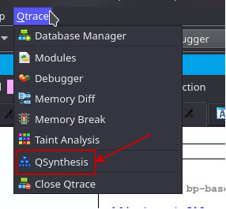
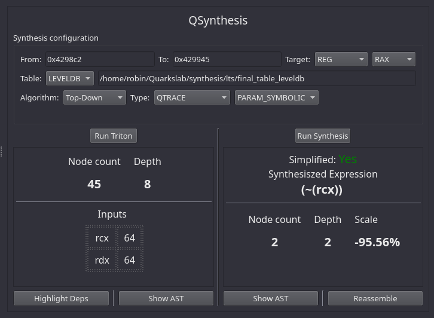
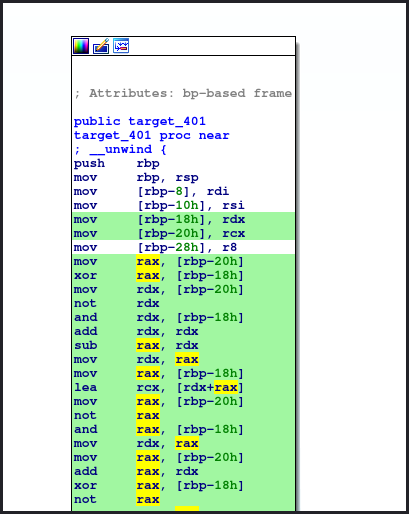
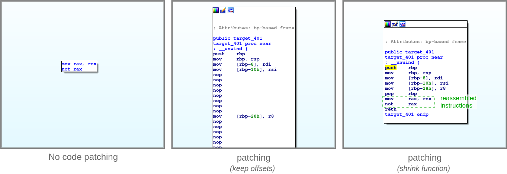

IDA Plugin Walkthrough
======================

Introduction
------------

.. _label_intro_plugin:

The IDA plugin works in two manner, with Qtrace-IDA and without Qtrace-IDA. If
Qtrace-IDA is installed the plugin will use the trace loaded within Qtrace-IDA.
Qtrace-IDA will automatically detect QSynthesis as a Qtrace-IDA addon and will
put it in its menu.

Without IDA, QSynthesis provides the basic functionalities to load a trace and
to work on it. In both modes the same functionalities are provided.

The default shortcut to launch QSynthesis is: **Alt+S**

Main Interface
--------------

Figure shown below shows the main UI after having sequentially set the parameters
and clicked 'Run Triton' and 'Run Synthesis' to synthesize an expression.

From and To fields defines the address bounds of the trace where to perform
the symbolic execution. Note that the first occurence in the trace of the start
address is used. Similarly, the first occurence of the stop address after the start
address is used. The target is either a register, either a memory location. A
third is operand but is a high-level refinement for a register or memory.

The other parameter specifies options for the synthesis, kind of algorithm etc.
These parameters are directly sent to the APIs.

.. note:: In full symbolic the analysis process is the exact same. The only difference
          is that QSynthesis assumes that all items located between 'From' and 'To' are
          a sequential list of instructions.

Popup Actions
-------------

Various context-menu actions are registered in the IDA-View allowing to easily
select the 'From' and 'To' addresses right from the GUI. It also allows to synthesize
a given operand in the view. The image below shows the context-menu added.

.. figure:: ../figs/popup-actions.png
   :scale: 100 %
   :align: center
   :alt: Popup-actions

These three actions can directly be triggered with theirs shortcut Ctrl+Shift+A, Ctrl+Shift+Z
for 'From' and 'To' *(as it is cumbersome to copy past addresses)*. The last Ctrl+Shift+O takes
the operand under the mouse and adjust the target accordingly.

.. note:: The synthesizing operand action, automatically adjust the 'To' address depending
          on whether the operand is a destination operand or a source operand.

Exploiting results
==================

Results are shown in the two views of the main UI, but buttons at the bottom
provides various functionalities described hereafter.

Showing AST's
-------------

Bitvector expressions after symbolic expression and after synthesis can be printed using
the graph API of IDA. The image below shows the two graph side-by-side of the AST before
synthesis *(Show AST button in Triton side)* and the AST after synthesis *(Show AST button
in synthesis side)*

.. figure:: ../figs/asts.png
   :alt: AST shown side-by-side

Showing Depencencies
--------------------

Another feature is to show the dynamic slice dependency of a bitvector expression in the
IDA View. The button 'Show Deps' highlight in the IDA-View all instructions involved in
the computation of the expression. The image below shows the result obtained.

Reassembly
----------

The last feature provided by the plugin is a trivial *(and unsound)* reassembly of the
synthesized AST into fresh unobfuscated instructions. The reassembly process use the
amazing `ayrbo <https://github.com/quarkslab/arybo>` project that turns Triton ASTs
back to LLVM and then compiled bytes. When clicking the 'Reassemble' button. A dialog
window asks for various parameters.

.. figure:: ../figs/reassembly-opts.png
   :scale: 75 %
   :align: center
   :alt: Reassembly options

The three scenarios are:
* No ticking of any options: The synthesized expression is reassembled in an IDA graph view
* Ticking 'patch functions bytes': All dependent instructions (cf. above), are erased with
NOPs and the reassembled instructions are put on the 'To' location where it was extracted
* Ticking 'patch' + 'shrink function': The function is rewriting with only instructions not
in the dependency and the reassembled instructions.

The two latest, do tamper the IDB *(for good :) )* and somehow save the synthesized expression
result directly back in the IDB. The figure below shows the result obtained with the
three variants of the reassembly.

.. note:: The reassembly does not take in account use-defs etc. The reassembly is purely
          syntactical. Thus it might work, but to program is unlikely to run well. A proper
          non-interference analysis should be performed to make sure the semantic is preserved.

Debugging
=========

For debugging it is possible to access the QSynthesis view via Qtrace-IDA with the following code:

.. code-block:: python

    import qtraceida
    qtrace = qtraceida.get_qtrace()
    view = qtrace.get_view("QSynthesis")

Note that ``get_view`` will return None if the view is not shown.
Then you have access to all internal structures and objects of the plugin to play around with it.
